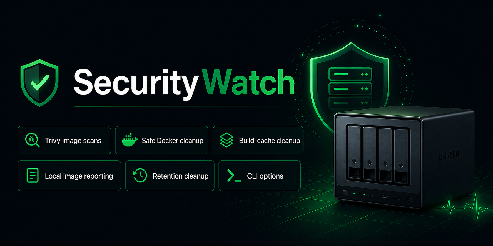
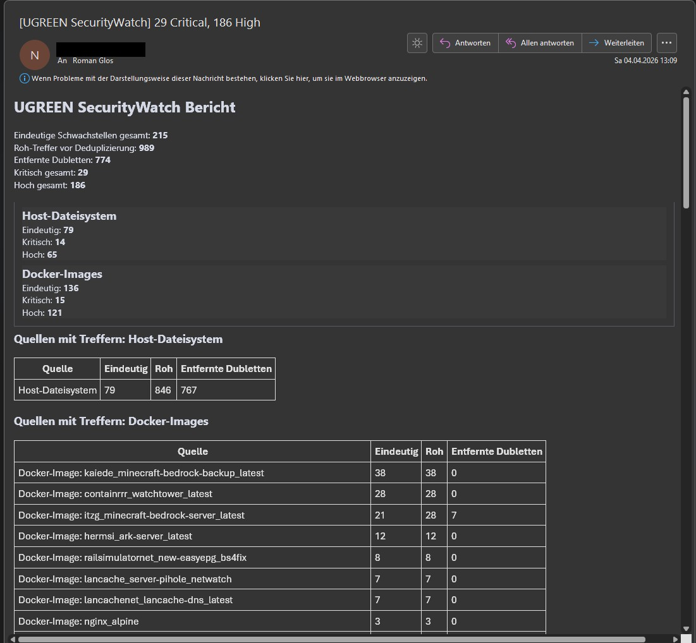
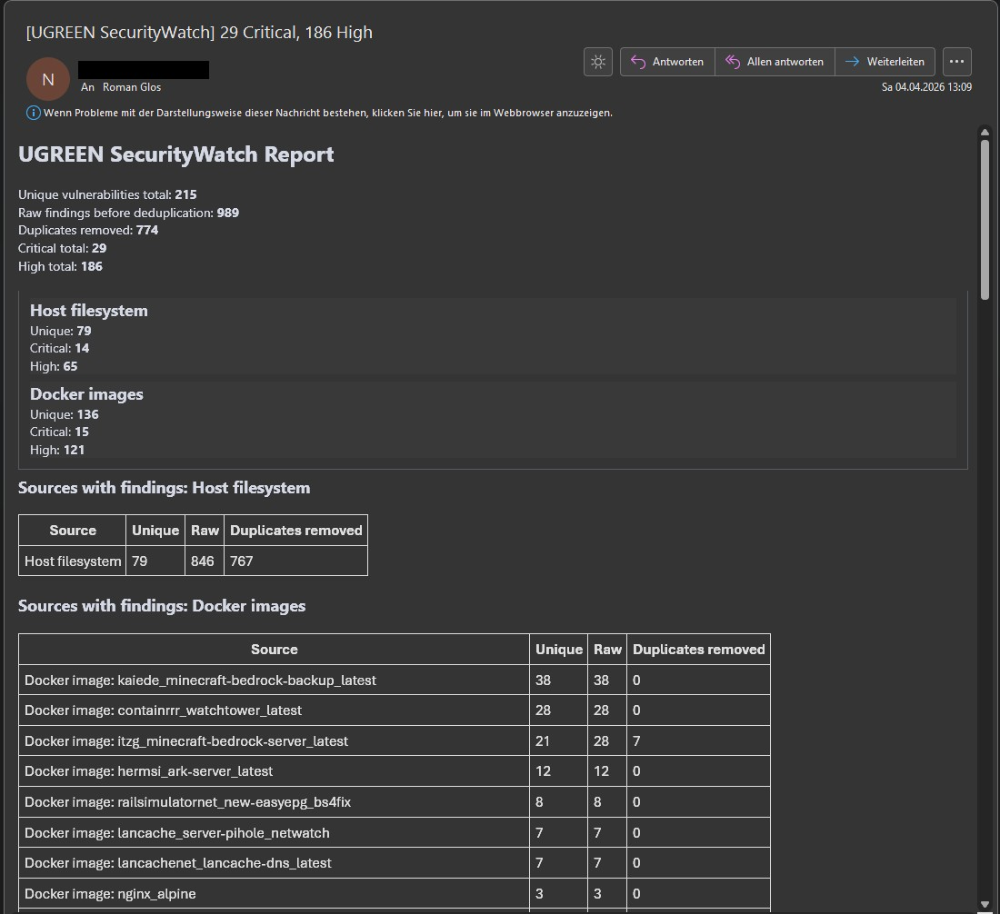

# UGREEN SecurityWatch

Community-Lösung für UGREEN NAS mit UGOS zur Prüfung von Host-Dateisystem und Docker-Images mit Trivy.

Community solution for UGREEN NAS systems running UGOS to scan the host filesystem and Docker images with Trivy.








## Deutsch

### Was ist UGREEN SecurityWatch?

UGREEN SecurityWatch ist ein leichtgewichtiges Skriptpaket für UGOS. Es scannt das Host-Dateisystem sowie die Docker-Images laufender Container mit Trivy, erstellt daraus eine Zusammenfassung und versendet anschließend eine Text- und HTML-Mail.

### Funktionen

- Host-Scan per Trivy `rootfs` gegen `/host`
- Scan der Docker-Images aktuell laufender Container
- Ausgabe als `summary.json`, `mail.txt` und `mail.html`
- Sprachumschaltung über `OUTPUT_LANG=de` oder `OUTPUT_LANG=en`
- Ein Report-Ordner pro Lauf unter `reports/<Datum_Uhrzeit>/`
- Versand nur bei Treffern oder optional auch als OK-Mail

### Release-Inhalt

```text
securitywatch/
├── .env.example
├── securitywatch_scan.sh
├── securitywatch_report.py
└── securitywatch_mail.py

Screens/
├── Securitywatch.jpg
└── SecuritywatchEN.jpg

UGREEN_SecurityWatch_Handbuch_DE-EN.pdf
README.md
.gitignore
```

### Wichtiger Hinweis zur Ordnerstruktur

Für die NAS-Installation ist **der innere Ordner `securitywatch/`** relevant. Der Repository-Root enthält zusätzlich nur Dokumentation, Screenshots und GitHub-Dateien.

Auf der NAS sollte der Zielpfad typischerweise so aussehen:

```bash
/volume2/docker/securitywatch
```

### Schnellstart

1. SSH in UGOS aktivieren.
2. Mit PuTTY oder einem anderen SSH-Client auf die NAS verbinden.
3. Mit `sudo -i` Root-Rechte anfordern.
4. Den Ordner `securitywatch/` aus diesem Repository nach `/volume2/docker/securitywatch` kopieren.
5. Aus `.env.example` eine aktive `.env` erzeugen.
6. SMTP und Sprache in `.env` anpassen.
7. Einen manuellen Testlauf starten.
8. Danach den automatischen Lauf per `crontab -e` einrichten.

### Beispielbefehle

```bash
sudo -i
mkdir -p /volume2/docker/securitywatch
cd /volume2/docker/securitywatch
cp .env.example .env
chmod +x securitywatch_scan.sh securitywatch_report.py securitywatch_mail.py
./securitywatch_scan.sh
```

### Wichtige `.env`-Variablen

- `OUTPUT_LANG` - Sprache der Ausgaben, Logs und Mails (`de` oder `en`)
- `BASE_DIR` - Basisordner des Projekts
- `REPORT_DIR` - Ziel für Laufberichte
- `CACHE_DIR` - Trivy-Cache
- `STATE_DIR` - Zustandsdaten
- `SMTP_SERVER`, `SMTP_PORT`, `SMTP_FROM`, `SMTP_TO` - SMTP-Versand
- `SMTP_USER`, `SMTP_PASS`, `SMTP_PASS_FILE` - SMTP-Anmeldung
- `MAIL_ONLY_ON_FINDINGS` - Mail nur bei Treffern
- `MAIL_SEND_OK` - OK-Mail auch ohne Treffer erlauben
- `MAIL_SUBJECT_PREFIX` - fester Betreff-Präfix

Die Datei `.env.example` enthält ausführliche deutsche und englische Beschreibungen zu allen Variablen.

### Cron-Beispiel

Täglicher Lauf um 06:30 Uhr:

```bash
30 6 * * * cd /volume2/docker/securitywatch && /volume2/docker/securitywatch/securitywatch_scan.sh >> /volume2/docker/securitywatch/cron.log 2>&1
```

### Dokumentation

- [Handbuch / Manual (PDF)](./UGREEN_SecurityWatch_Handbuch_DE-EN.pdf)


---

## English

### What is UGREEN SecurityWatch?

UGREEN SecurityWatch is a lightweight script package for UGOS. It scans the host filesystem and the Docker images of running containers with Trivy, builds a summary and then sends a plain text and HTML email.

### Features

- Host scan via Trivy `rootfs` against `/host`
- Scan of Docker images used by currently running containers
- Output as `summary.json`, `mail.txt` and `mail.html`
- Language switch via `OUTPUT_LANG=de` or `OUTPUT_LANG=en`
- One report folder per run under `reports/<date_time>/`
- Send only on findings or optionally also as an OK mail

### Package contents

```text
securitywatch/
├── .env.example
├── securitywatch_scan.sh
├── securitywatch_report.py
└── securitywatch_mail.py

Screens/
├── Securitywatch.jpg
└── SecuritywatchEN.jpg

UGREEN_SecurityWatch_Handbuch_DE-EN.pdf
README.md
.gitignore
```

### Important note about folder structure

For installation on the NAS, **the inner `securitywatch/` folder** is the important one. The repository root only contains documentation, screenshots and GitHub-related files.

On the NAS, the target path will usually look like this:

```bash
/volume2/docker/securitywatch
```

### Quick start

1. Enable SSH in UGOS.
2. Connect to the NAS with PuTTY or another SSH client.
3. Request root privileges with `sudo -i`.
4. Copy the `securitywatch/` folder from this repository to `/volume2/docker/securitywatch`.
5. Create an active `.env` from `.env.example`.
6. Adjust SMTP and language settings in `.env`.
7. Run a first manual test.
8. Then configure the automatic run with `crontab -e`.

### Example commands

```bash
sudo -i
mkdir -p /volume2/docker/securitywatch
cd /volume2/docker/securitywatch
cp .env.example .env
chmod +x securitywatch_scan.sh securitywatch_report.py securitywatch_mail.py
./securitywatch_scan.sh
```

### Important `.env` variables

- `OUTPUT_LANG` - language of console output, logs and emails (`de` or `en`)
- `BASE_DIR` - base directory of the project
- `REPORT_DIR` - destination for run reports
- `CACHE_DIR` - Trivy cache
- `STATE_DIR` - state data
- `SMTP_SERVER`, `SMTP_PORT`, `SMTP_FROM`, `SMTP_TO` - SMTP delivery
- `SMTP_USER`, `SMTP_PASS`, `SMTP_PASS_FILE` - SMTP authentication
- `MAIL_ONLY_ON_FINDINGS` - send mail only when findings exist
- `MAIL_SEND_OK` - allow OK mail even without findings
- `MAIL_SUBJECT_PREFIX` - fixed subject prefix

The `.env.example` file contains detailed German and English explanations for all variables.

### Cron example

Daily run at 06:30:

```bash
30 6 * * * cd /volume2/docker/securitywatch && /volume2/docker/securitywatch/securitywatch_scan.sh >> /volume2/docker/securitywatch/cron.log 2>&1
```

### Documentation

- [Handbuch / Manual (PDF)](./UGREEN_SecurityWatch_Handbuch_DE-EN.pdf)
